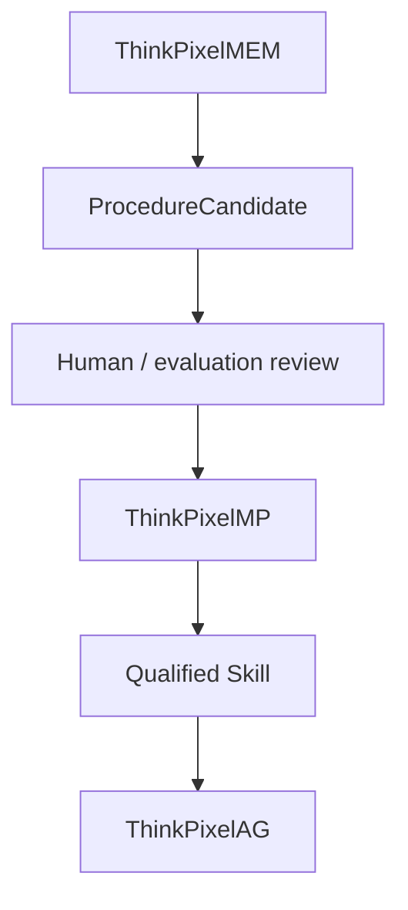
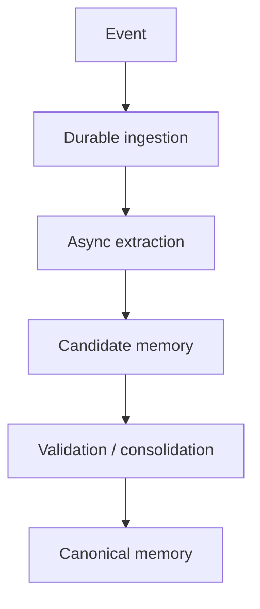
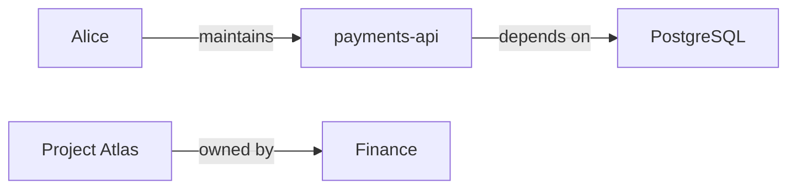
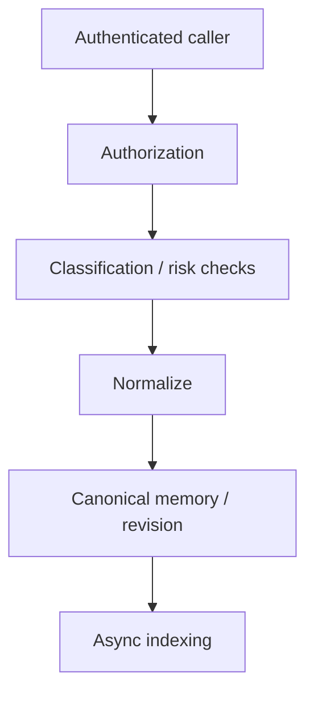
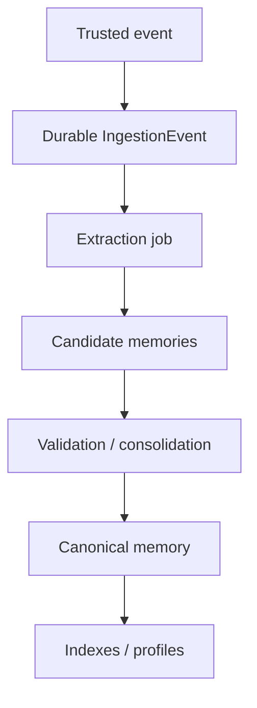
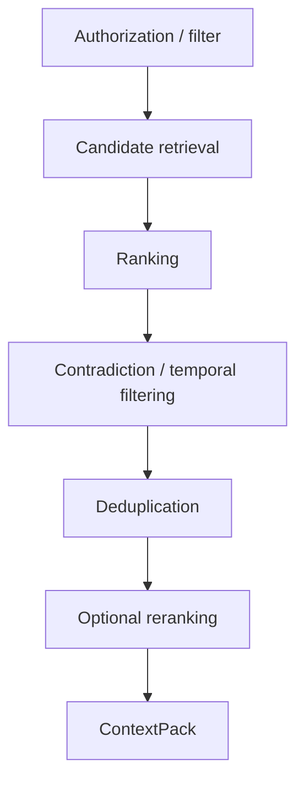
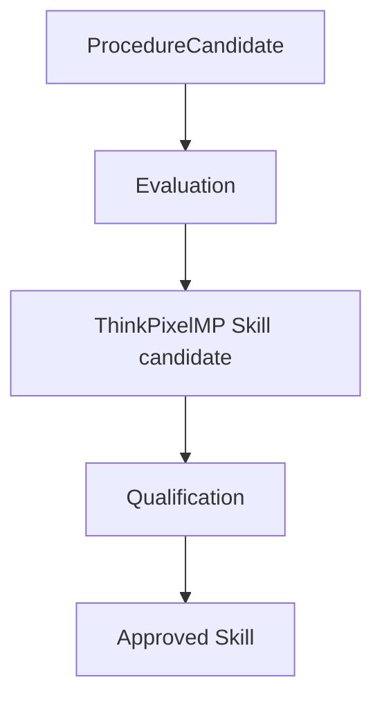
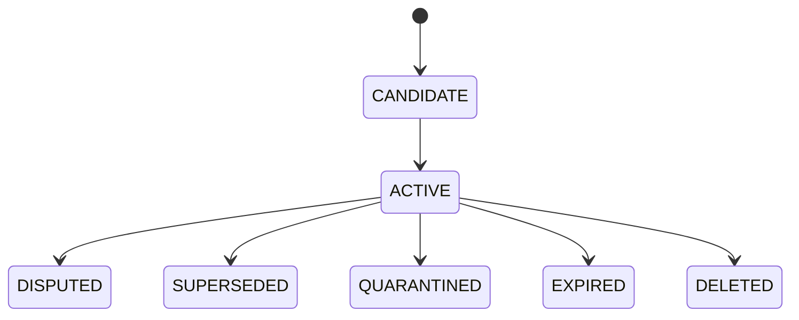
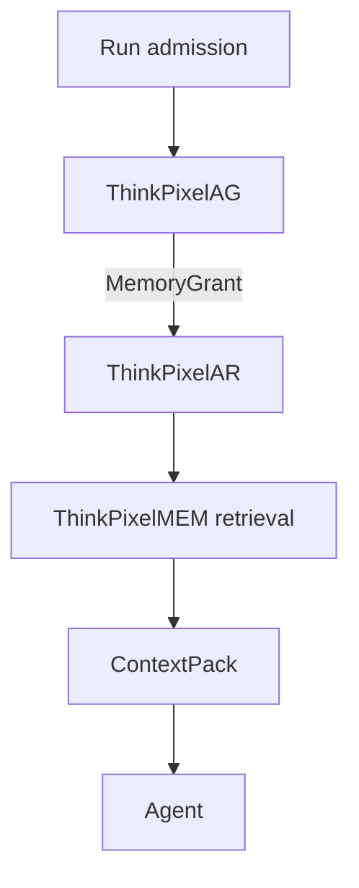
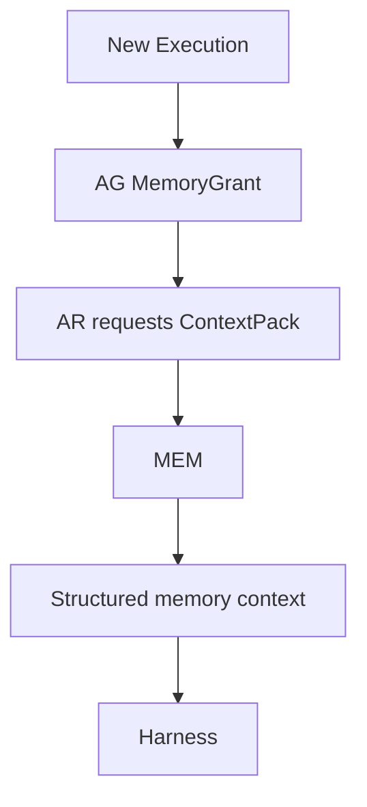

# ThinkPixelMEM Implementation Plan

## 1. Purpose

This document is the implementation contract for taking ThinkPixelMEM from an empty repository to a release candidate.

ThinkPixelMEM is the **enterprise memory layer** of the ThinkPixel stack. It provides durable, scoped, explainable, temporal, revisable, and governable memory for AI agents without coupling memory to one model vendor, agent framework, vector database, or execution runtime.

`TODO.md` is the chronological execution ledger. This plan explains why and how; the checklist records what remains, what was implemented, and what evidence verified each implementation step.

The core design thesis is:

> **AR remembers what happened. WS preserves the work. MEM preserves what was learned. AG decides what may be recalled or written.**

The primary security principles are:

> **Memory is durable context, not durable authority.**

> **Retrieved memory is evidence, not trusted instruction.**

> **Observation is not inference. Confidence is not source trust.**

> **Memory revisions preserve history instead of silently rewriting it.**

> **Derived indexes are disposable. Canonical memory state is durable and auditable.**

---

## 2. Product boundary

ThinkPixelMEM owns durable memory/control state:

- MemorySpace identity and ownership;
- MemorySpace classification and retention policy;
- episodic memories;
- semantic claims;
- claim revisions;
- temporal validity;
- relationships;
- profile schemas;
- derived profiles;
- outcomes and lessons;
- procedure candidates;
- provenance/evidence references;
- source trust metadata;
- confidence metadata;
- contradictions;
- supersession;
- memory lifecycle;
- memory correction;
- memory deletion/forget;
- retention and TTL;
- memory-write proposals;
- memory extraction jobs;
- consolidation jobs;
- retrieval policy;
- ContextPack assembly;
- retrieval indexes and rebuild state;
- memory access audit;
- memory events;
- memory strategy configuration;
- poisoning/risk metadata.

ThinkPixelMEM does **not** own:

- authoritative agent Session history;
- Workspace files or document repositories;
- Git repositories;
- raw enterprise knowledge/RAG corpus;
- Run admission;
- runtime capability grants;
- model-provider credentials;
- downstream enterprise credentials;
- agent execution;
- sandbox lifecycle;
- reusable approved Agent Skills;
- agent response generation;
- general workflow orchestration;
- model routing;
- general content moderation policy;
- browser/application profile state.

When integrated with the complete ThinkPixel platform:

- **ThinkPixelAR** owns Session/execution history;
- **ThinkPixelWS** owns durable work context and source content;
- **ThinkPixelMEM** owns durable learned context;
- **ThinkPixelAG** determines Run-scoped memory read/write authority;
- **ThinkPixelLLMGW** provides models and embeddings used by memory processing;
- **ThinkPixelGR** may inspect candidate memory and recalled context for risk;
- **ThinkPixelTG** provides evidence/outcomes from governed external actions;
- **ThinkPixelMP** may qualify reusable extraction strategies, profile schemas, and promoted procedural knowledge.

ThinkPixelMEM must remain independently useful without requiring the entire ThinkPixel stack.

---

## 3. Product principles

### 3.1 Long-term memory only

ThinkPixelMEM is not the canonical store for raw conversational Session state.

ThinkPixelAR owns:

- messages;
- Run/Execution history;
- Attempts;
- harness continuity;
- runtime events.

MEM consumes selected events or explicit observations and derives durable memories.

The boundary is:

    AR:
      what happened?

    MEM:
      what should remain useful after the event history is no longer in immediate context?

### 3.2 Memory is not Workspace content

ThinkPixelWS owns:

- repositories;
- documents;
- Workspace files;
- snapshots;
- generations;
- external bindings.

MEM may store:

    "payments-api uses PostgreSQL 16"

with provenance:

    workspace://W123/g42/backend/...

The source file remains in WS.

MEM stores the learned claim and its evidence reference.

### 3.3 Memory is not enterprise knowledge retrieval

A knowledge/RAG system answers:

> What existing document or corpus content is relevant?

MEM answers:

> What has the system learned from prior interactions, work, observations, outcomes, and explicit user assertions?

The two systems may be queried together but remain separate services.

### 3.4 Memory cannot grant authority

The invariant is:

    Recall(memory) != CapabilityGrant

A memory such as:

    "Alice is allowed to deploy production"

does not grant deployment rights.

ThinkPixelAG remains authoritative.

### 3.5 Memory cannot change platform policy

The invariant is:

    MemoryContent != GovernancePolicy

Retrieved memory must never be inserted into a trusted system/policy channel merely because it is durable.

### 3.6 Learned procedure is not trusted executable behavior

A learned procedure such as:

    "Always run go test before opening a PR"

may be useful.

It remains a `ProcedureCandidate`.

The invariant is:

    ProcedureCandidate != ApprovedSkill

If an organization wants to promote persistent learned behavior into reusable trusted instructions, the preferred future path is:

### 3.7 Observation is distinct from inference

Every canonical memory records how the assertion entered the system.

Initial source kinds include:

- explicit-user-assertion;
- verified-tool-output;
- workspace-observation;
- agent-observation;
- model-inference;
- imported-external-memory;
- system-derived.

An inference must never silently become an observed fact.

### 3.8 Confidence is distinct from source trust

An extraction model may be highly confident in information obtained from an untrusted source.

Therefore:

    confidence != source_trust

Both values are independently represented and used by retrieval/policy.

### 3.9 Authoritative metadata is not LLM-controlled

The following metadata is authoritative and supplied by trusted infrastructure:

- tenant;
- principal;
- MemorySpace;
- Run;
- Session;
- Workspace;
- source reference;
- classification;
- residency;
- timestamps;
- source trust class;
- evidence identities.

An LLM may derive:

- topics;
- entities;
- summary;
- confidence;
- importance;
- candidate relationships.

The LLM cannot modify authoritative metadata.

### 3.10 History is revised, not rewritten

Corrections create revisions.

Example:

    revision 1:
      launch date = September 5

    revision 2:
      launch date = September 12

The system preserves:

- old assertion;
- new assertion;
- correction source;
- revision reason;
- temporal validity.

Completed revisions are immutable.

### 3.11 Memory should be temporal

Facts change.

ThinkPixelMEM should support at least:

- `valid_from`;
- `valid_until`;
- `observed_at`;
- `recorded_at`;
- `superseded_at`.

This permits answering both current-state and historical-state questions.

### 3.12 Memory is scoped

Memory exists in explicit MemorySpaces.

Agents do not automatically receive every memory available to the organization.

Memory access is attached to each Run or caller authorization.

### 3.13 Indexes are derived projections

PostgreSQL is canonical for memory state.

Vector, lexical, graph, profile, and other retrieval indexes are rebuildable projections.

Loss of a retrieval index must not destroy memory.

### 3.14 Extraction should normally be asynchronous

The hot user interaction path should not wait for every possible long-term memory to be extracted, consolidated, embedded, and reconciled.

Preferred flow:

Explicit user `remember` actions may have a synchronous fast path.

---

## 4. MemorySpace

A `MemorySpace` is the primary ownership, isolation, and policy boundary.

Example spaces:

    user/alice
    workspace/payments
    agent/security-reviewer
    team/platform
    organization/acme

A MemorySpace contains:

- ID;
- tenant;
- scope type;
- scope subject;
- name;
- classification;
- residency;
- retention policy;
- memory strategy;
- read policy;
- write policy;
- lifecycle state;
- timestamps.

### 4.1 Initial scope types

Support:

- `user`;
- `agent`;
- `workspace`;
- `team`;
- `organization`;
- `custom`.

The exact permitted scope vocabulary is configurable but strongly typed.

### 4.2 Scope does not imply visibility

Existence of:

    organization/acme

does not mean every agent may read organization memory.

Access still requires authorization.

---

## 5. Memory types

### 5.1 Episode

An `Episode` represents an event or experience worth retaining.

Examples:

- a Run discovered an authorization bug;
- a user corrected a previous assumption;
- a deployment failed;
- a reviewer rejected a finding;
- a tool action produced an unexpected outcome.

Episode fields include:

- ID;
- MemorySpace;
- title/summary;
- source;
- timestamp/range;
- involved entities;
- evidence references;
- classification;
- importance;
- outcome references;
- lifecycle state.

Episodes are largely immutable historical facts.

Corrections should normally create annotations/revisions rather than rewriting history.

### 5.2 Claim

A `Claim` represents semantic knowledge.

Conceptually:

    subject
    predicate
    value/object

Example:

    subject: payments-api
    predicate: database.version
    value: PostgreSQL 16

A Claim includes:

- ID;
- MemorySpace;
- subject;
- predicate;
- value;
- value type;
- validity interval;
- observation time;
- recording time;
- source kind;
- source trust;
- confidence;
- classification;
- evidence references;
- status;
- active revision;
- extraction metadata.

### 5.3 Relationship

A `Relationship` represents a structured relationship among entities.

Examples:

Relationships use the same:

- provenance;
- temporal validity;
- confidence;
- source trust;
- revision;

principles as Claims.

### 5.4 Profile

A Profile is a schema-defined, fast materialized projection over underlying memories.

Examples:

    user-preferences-v1
    project-context-v2
    stakeholder-collaboration-v1

A Profile is not canonical truth.

Every Profile field must be explainable through underlying memory IDs/evidence.

### 5.5 Outcome

An Outcome records the result of an action/episode.

Examples:

- review accepted;
- test failed;
- user rejected recommendation;
- deployment rolled back;
- requested response arrived quickly.

Outcome data allows the system to learn from prior experiences.

### 5.6 Lesson

A Lesson is a derived generalization supported by one or more Outcomes/Episodes.

Example:

    "Narrowly scoped review requests receive faster responses from stakeholder X."

Lesson fields include:

- underlying episode/outcome references;
- confidence;
- derivation strategy;
- temporal applicability;
- revision history.

### 5.7 ProcedureCandidate

A ProcedureCandidate is a learned behavior/rule that might be useful in future work.

It is explicitly not trusted executable instruction.

ProcedureCandidates may eventually be promoted into approved Skills through ThinkPixelMP.

---

## 6. Canonical claim model

A canonical Claim should resemble:

    id
    tenant_id
    memory_space_id

    subject
    predicate
    value
    value_type

    valid_from
    valid_until

    observed_at
    recorded_at

    status:
      active
      disputed
      superseded
      withdrawn

    confidence
    source_trust

    source_kind

    classification
    residency

    active_revision_id

    created_by_run_id
    created_by_session_id
    created_by_principal

    extractor_id
    extractor_version

The active revision contains the mutable semantic state while historical revisions remain immutable.

---

## 7. Evidence and provenance

Memory must answer:

> Why does the system believe this?

Every canonical memory may reference zero or more `EvidenceReference` objects.

Initial evidence reference kinds include:

- AR event;
- AR Session/Run;
- WS Workspace generation;
- WS component/file reference;
- TG tool invocation;
- TG tool result;
- user message;
- external document;
- imported memory;
- model-extraction request.

An EvidenceReference stores:

- source type;
- source identifier;
- immutable version/generation where available;
- timestamp;
- source trust;
- classification;
- digest/reference where available.

Large source content remains in the owning service.

MEM stores references and safe excerpts only where explicitly required.

---

## 8. Revisions and correction

### 8.1 MemoryRevision

Every revisable memory object has immutable revisions.

A revision records:

- revision number;
- full normalized state;
- author/source;
- reason;
- created time;
- previous revision;
- evidence;
- integrity digest.

### 8.2 Explicit correction

User/API may correct a memory.

Correction produces a new revision.

The prior revision remains visible to authorized audit/inspection operations.

### 8.3 Supersession

When a new fact replaces an old fact:

    Claim A
      valid_until = T

    Claim B
      valid_from = T

Both remain historically valid for their periods.

### 8.4 Dispute

Conflicting evidence may produce:

    status = disputed

instead of selecting a winner immediately.

Context retrieval must expose dispute state.

---

## 9. Memory write architecture

There are two primary write paths.

### 9.1 Explicit memory write

Caller explicitly requests durable memory.

Examples:

    Remember that production changes require two reviewers.

    Remember that I prefer concise code reviews.

Flow:

Explicit memory writes retain:

    source_kind = explicit-user-assertion

unless the API caller supplies another trusted source type.

### 9.2 Observational ingestion

Events from AR, WS, TG, or other trusted systems enter an ingestion stream.

Flow:

The ingestion event itself is not automatically a memory.

---

## 10. Ingestion sources

### 10.1 ThinkPixelAR

AR may provide:

- completed Run summaries;
- user-visible messages;
- tool evidence references;
- Session/Run IDs;
- runtime outcomes.

Do not persist provider-private chain-of-thought.

### 10.2 ThinkPixelWS

WS may provide:

- Workspace ID;
- generation;
- component provenance;
- file/document references;
- classification;
- changes/events.

MEM stores learned claims about Workspace contents, not a duplicate Workspace.

### 10.3 ThinkPixelTG

TG may provide:

- tool invocation identity;
- explicit outcome;
- verified external data;
- ambiguous outcome state.

Tool result provenance can have higher source trust than model inference.

### 10.4 Explicit application/user writes

Applications may submit explicit memories where authorized.

### 10.5 Imported external memory

External memory systems may be imported through a typed importer.

Imported memories retain:

- original source;
- original ID;
- source trust;
- import time;
- conversion provenance.

Import never silently marks external memory as trusted.

---

## 11. Candidate memory

LLM-based extraction does not directly write canonical truth.

Extraction first creates `MemoryCandidate`.

A MemoryCandidate contains:

- proposed type;
- normalized content;
- derived metadata;
- confidence;
- extraction model/request reference;
- source evidence;
- candidate relationships;
- proposed MemorySpace;
- policy status.

Candidate validation then checks:

- authoritative scope;
- classification;
- duplication;
- contradiction;
- source trust;
- sensitive-data rules;
- poisoning/instruction risk;
- retention policy;
- schema validity.

Only validated candidates become canonical memory.

---

## 12. Memory extraction

Define a `MemoryExtractor` port.

Conceptually:

    type MemoryExtractor interface {
        Extract(ctx context.Context, req ExtractionRequest) ([]MemoryCandidate, error)
    }

The first model-backed implementation uses ThinkPixelLLMGW.

MEM never stores provider API credentials.

### 12.1 Extraction outputs

Initial extraction can identify:

- episode summaries;
- claims;
- entities;
- relationships;
- preferences;
- outcomes;
- possible lessons;
- procedure candidates.

### 12.2 Extraction configuration

Memory extraction strategy is configurable per MemorySpace.

A strategy may specify:

    extract:
      episodes: true
      claims: true
      relationships: true
      preferences: true
      procedureCandidates: false

    confidenceThreshold: 0.65

    sensitiveInference:
      deny

    retention:
      episode: 180d
      claim: indefinite

---

## 13. Consolidation

Repeated observations should not create endless duplicated facts.

Define a `Consolidator` abstraction.

Its responsibilities include:

- deduplication;
- claim matching;
- confidence update;
- contradiction detection;
- temporal supersession;
- relationship merge;
- revision creation.

Consolidation may use deterministic rules plus LLM assistance.

Canonical transitions remain validated in trusted application logic.

---

## 14. Model access through ThinkPixelLLMGW

All model-assisted operations route through ThinkPixelLLMGW in integrated mode.

Use cases include:

- extraction;
- consolidation assistance;
- summarization;
- embeddings;
- reranking;
- profile derivation;
- lesson derivation.

MEM records:

- LLMGW request reference;
- model class/policy reference where useful;
- extractor version.

MEM does not need to know provider credentials.

Standalone mode may support any OpenAI-compatible/model adapter behind a port, but the ThinkPixel reference deployment uses LLMGW.

---

## 15. Guardrail/risk integration

ThinkPixelGR may participate in memory safety.

Potential hooks:

### Write inspection

Evaluate candidate memory for:

- persistent prompt injection;
- credentials/secrets;
- prohibited sensitive inference;
- harmful instruction-like payloads;
- policy violations.

### Retrieval inspection

Evaluate selected context for:

- suspicious persistent instructions;
- classification crossing;
- poisoned low-trust memory;
- dangerous prompt structure.

GR is not the only enforcement mechanism.

Deterministic scope, classification, provenance, and authorization remain enforced by MEM/AG.

---

## 16. Memory poisoning model

Memory poisoning is a first-class threat.

Attack sources include:

- malicious repository instructions;
- malicious website content;
- hostile Slack/document content;
- poisoned tool output;
- attacker-controlled user messages;
- compromised agent;
- compromised imported memory.

### 16.1 Instruction-like content

A memory containing instruction-like text is treated as data.

It is never promoted automatically into trusted control instructions.

### 16.2 Source trust

Low-trust sources can still produce useful memory but retrieval/promotion policy may:

- down-rank;
- flag;
- require corroboration;
- restrict profile inclusion;
- prevent procedural promotion.

### 16.3 Corroboration

Policies may require multiple independent evidence sources before high-impact Claims become active/high-confidence.

### 16.4 Quarantine

Suspicious memories may be quarantined without deleting historical evidence.

---

## 17. Memory access authority

Define a `MemoryAuthorizer` port for standalone/admin access.

ThinkPixel-integrated runtime access uses AG-issued MemoryGrants.

A MemoryGrant may contain:

    read:
      - memory_space_id
        memory_types
        classification ceiling

    write:
      - memory_space_id
        allowed memory types

    retrieval:
      max_items
      max_tokens
      allow_profiles
      allow_episodes
      allow_claims

    limits:
      write_count
      expiry

The exact AG contract is finalized jointly with ThinkPixelAG.

### 17.1 No namespace escape

The harness cannot request arbitrary MemorySpaces outside its grant.

### 17.2 Read and write are independent

The invariant is:

    CanWrite(space) != CanRead(space)

Policies may support ingestion-only writers.

---

## 18. Retrieval architecture

Retrieval returns structured memory, not merely text snippets.

The canonical API produces a `ContextPack`.

Inputs may include:

- goal/query;
- Run;
- MemoryGrant;
- Workspace;
- subjects/entities;
- time constraints;
- requested memory types;
- token budget;
- result count.

The retrieval engine:

---

## 19. ContextPack

A ContextPack may contain:

    profiles
    claims
    relationships
    episodes
    outcomes
    lessons
    procedure candidates
    warnings
    retrieval metadata

Every item retains:

- memory ID;
- revision;
- type;
- confidence;
- source trust;
- temporal validity;
- status;
- provenance references;
- classification;
- retrieval score/reason where safe.

Example:

    claim:
      text: "payments-api uses PostgreSQL 16"
      confidence: 0.98
      sourceTrust: verified-tool-output
      validFrom: ...
      evidence:
        - workspace://W123/g42/backend/...

    warning:
      "Claim C88 is disputed."

### 19.1 ContextPack is untrusted context

Consumers must not inject ContextPack contents as privileged system policy.

SDK/docs should explicitly distinguish:

    trusted platform instructions
        vs
    retrieved memory context

---

## 20. Retrieval scoring

Retrieval should support multiple signals.

Conceptually:

    score =
        semantic relevance
      + lexical relevance
      + entity relevance
      + graph proximity
      + goal relevance
      + recency/freshness
      + importance
      + evidence quality
      + source trust
      + temporal validity
      - contradiction penalty
      - redundancy penalty
      - poison-risk penalty

Exact scoring is configurable and versioned.

The retrieval policy version is included in debug/evidence output.

---

## 21. Retrieval indexes

Define a generic `RetrievalIndex` port.

    type RetrievalIndex interface {
        Search(ctx context.Context, query SearchQuery) ([]CandidateID, error)
        Upsert(ctx context.Context, records []IndexRecord) error
        Delete(ctx context.Context, ids []MemoryID) error
        Rebuild(ctx context.Context, source CanonicalMemorySource) error
    }

### 21.1 MVP backend

Initial reference backend:

    PostgreSQL = canonical

    Qdrant =
      dense vectors
      sparse/lexical representation
      metadata filters

A separate lexical backend may be introduced if Qdrant capabilities prove insufficient.

### 21.2 Graph projection

Graph retrieval is post-MVP unless necessary for core quality.

The domain model should support graph relationships from day one.

Graph index remains derived.

---

## 22. Embeddings

Embeddings are derived data.

Requirements:

- embedding model/version recorded;
- re-embedding supported;
- embedding vectors not canonical truth;
- deletion/forget cascades to embeddings;
- tenant/scope metadata enforced during search;
- model changes do not rewrite memory identity.

Embeddings should normally be produced through LLMGW or a configurable embedding adapter.

---

## 23. Profiles

### 23.1 ProfileSchema

A ProfileSchema defines:

- profile name/version;
- subject type;
- fields;
- field type;
- derivation rules;
- allowed source types;
- sensitivity policy;
- freshness;
- retention.

Examples:

    project-context-v1
    user-preferences-v1

### 23.2 Derived Profile

A Profile instance references underlying memories.

Each field includes:

- value;
- confidence;
- source trust;
- last updated;
- memory references.

### 23.3 Sensitive attributes

Sensitive personal attributes must not be inferred by default.

Profile schemas require explicit data policy.

---

## 24. Procedural promotion

ProcedureCandidates remain memory.

They may be reviewed/exported.

Future integration:

MEM itself does not activate procedure candidates as privileged behavior.

---

## 25. Retention and forgetting

ThinkPixelMEM must support actual forgetting.

### 25.1 Retention

Retention may be configured by:

- MemorySpace;
- memory type;
- classification;
- subject;
- organization policy.

### 25.2 TTL

Memories may expire automatically.

Expiry must produce deterministic lifecycle events.

### 25.3 Forget operations

Support:

- forget memory;
- forget subject;
- forget MemorySpace;
- forget by source;
- forget by user/data-subject;
- administrative deletion.

### 25.4 Legal hold

A policy seam should permit legal-hold restrictions.

### 25.5 Derived-data deletion

Forgetting canonical memory cascades to:

- Qdrant vectors;
- sparse indexes;
- graph projection;
- derived profiles;
- summaries;
- caches.

Audit metadata may retain non-sensitive evidence that deletion occurred, according to policy.

---

## 26. Memory lifecycle

Suggested lifecycle:

Historical revisions remain subject to retention/deletion policy.

Exact lifecycle differs by memory type and is formalized in Phase 0.

---

## 27. Search/debug/inspectability

Enterprise memory must be inspectable.

Authorized operators/users should be able to answer:

- why is this memory present?
- who/what created it?
- which source supports it?
- which model extracted it?
- which revisions existed?
- which memories derived this Profile field?
- when was it last used?
- why was it retrieved?
- why is it disputed?
- why was it deleted/quarantined?

This is a core product requirement, not a debugging afterthought.

---

## 28. Memory usage evidence

ThinkPixelMEM may record bounded retrieval-use metadata:

- Run ID;
- ContextPack ID;
- memory IDs selected;
- retrieval policy;
- timestamp.

Do not duplicate full prompt/model content unless explicitly configured.

Usage records allow later auditing:

> Which memories influenced Run R?

---

## 29. ThinkPixelAG integration

Preferred flow:

AG decides:

- readable MemorySpaces;
- writable MemorySpaces;
- types;
- classification ceiling;
- limits;
- expiry.

MEM verifies the grant on every runtime operation.

Memory never expands the AG grant.

---

## 30. ThinkPixelAR integration

AR remains canonical for raw Session/execution history.

MEM may consume normalized AR events asynchronously.

AR may request ContextPacks during Session/Run setup.

Potential flow:

AR does not persist MEM as part of Session authority.

---

## 31. ThinkPixelWS integration

Workspace-scoped MemorySpaces can use Workspace identity as scope subject.

MEM stores:

- Workspace-related Claims;
- Episodes;
- Outcomes;
- Relationships.

Evidence references bind to exact Workspace generations where possible.

Workspace deletion/retention policies may trigger memory-retention policy evaluation but do not automatically erase memory unless configured.

---

## 32. ThinkPixelTG integration

TG provides strong evidence for external effects and observations.

Example:

    TG invocation:
      deployment.status -> failed

may produce:

    source_kind = verified-tool-output

TG ambiguous outcomes remain ambiguous in MEM.

MEM must not turn:

    outcome = UNKNOWN

into:

    deployment failed

without additional evidence.

---

## 33. ThinkPixelLLMGW integration

LLMGW is the reference path for:

- extraction;
- embeddings;
- consolidation assistance;
- profile derivation;
- optional reranking.

MEM requests use bounded service identity/tenant context.

Model-provider credentials never live in MEM database/configuration.

Model cost/usage remains authoritative in LLMGW.

---

## 34. ThinkPixelGR integration

GR may inspect:

- candidate write;
- retrieved ContextPack;
- suspicious procedure candidates.

MEM retains deterministic policy metadata and risk flags.

GR unavailability behavior is configured by memory operation class.

For protected memory writes/retrievals requiring GR, failure should fail closed.

---

## 35. ThinkPixelMP integration

Potential MP-qualified artifacts include:

- MemoryStrategy;
- ProfileSchema;
- extractor prompt/version;
- reranker configuration;
- promoted procedural Skill.

This is post-MVP where appropriate.

MEM should pin exact strategy/schema versions for reproducibility.

---

## 36. Standalone mode

ThinkPixelMEM must be usable independently.

Standalone deployment may use:

- local OIDC;
- local MemoryAuthorizer;
- direct model/embedding provider adapter;
- PostgreSQL;
- Qdrant.

Standalone mode provides memory isolation/retrieval but does not claim full ThinkPixel governance semantics.

---

## 37. API contract

REST/JSON with OpenAPI 3.1 is canonical for the RC.

Use:

- RFC 7807;
- OIDC/JWT;
- UUIDv7;
- UTC timestamps;
- W3C trace context;
- cursor pagination;
- `Idempotency-Key`;
- bounded request/response sizes;
- SSE for memory events where useful.

### 37.1 MemorySpace API

Candidate endpoints:

    POST /v1/memory-spaces
    GET  /v1/memory-spaces
    GET  /v1/memory-spaces/{id}
    DELETE /v1/memory-spaces/{id}

### 37.2 Memory API

Candidate endpoints:

    GET  /v1/memories
    GET  /v1/memories/{id}
    POST /v1/memories
    POST /v1/memories/{id}/correct
    POST /v1/memories/{id}/quarantine
    DELETE /v1/memories/{id}

### 37.3 Episode API

    POST /v1/episodes
    GET  /v1/episodes/{id}

### 37.4 Retrieval

    POST /v1/context/retrieve
    GET  /v1/context-packs/{id}

### 37.5 Profiles

    GET /v1/profiles/{profile_id}
    GET /v1/profile-schemas

### 37.6 Ingestion

Trusted/internal:

    POST /v1/events/ingest

### 37.7 Forget

    POST /v1/forget

### 37.8 Events

    GET /v1/events

---

## 38. Persistence

PostgreSQL is authoritative for:

- MemorySpaces;
- memory entities;
- revisions;
- Claims;
- Episodes;
- Relationships;
- Outcomes;
- Lessons;
- ProcedureCandidates;
- ProfileSchemas;
- Profiles;
- provenance/evidence refs;
- MemoryCandidates;
- ingestion events;
- extraction jobs;
- consolidation jobs;
- ContextPack metadata;
- retrieval-use evidence;
- retention;
- delete/forget state;
- idempotency;
- audit;
- outbox.

Large source documents remain outside MEM.

---

## 39. Database invariants

Enforce where practical:

- tenant scope;
- MemorySpace ownership;
- immutable revision history;
- monotonic revision numbers;
- active-revision integrity;
- evidence reference immutability;
- authoritative metadata immutability;
- no cross-tenant relationships;
- deterministic forget state;
- idempotent ingestion;
- job leases;
- transactional outbox;
- optimistic concurrency for correction;
- unique external event IDs.

Released migrations are immutable.

---

## 40. Background workers

Initial worker classes:

- ingestion processor;
- extraction worker;
- consolidation worker;
- embedding/index worker;
- profile builder;
- retention/expiry worker;
- forget/deletion worker;
- outbox worker;
- index repair/rebuild worker.

Workers use leases and idempotent operations.

A crash must be replay-safe.

---

## 41. Job semantics

Each job records:

- ID;
- tenant;
- source memory/event;
- strategy version;
- attempt;
- state;
- lease/fence;
- created/start/completion timestamps;
- error class;
- retry count.

Retry only where operation semantics are understood.

LLM requests should use stable logical operation IDs where supported.

---

## 42. Go implementation approach

Use a supported pinned Go release.

Expected layout:

    cmd/
      thinkpixelmem/
      migrate/
      thinkpixelmemctl/

    api/
      openapi/
      schemas/

    internal/
      domain/
        memoryspace/
        memory/
        claim/
        episode/
        relationship/
        profile/
        outcome/
        revision/
        contextpack/

      app/
        ingestion/
        extraction/
        consolidation/
        retrieval/
        profile/
        retention/
        forget/

      ports/
        authorization/
        llm/
        embedding/
        retrieval/
        guardrail/
        evidence/
        policy/
        clock/

      adapters/
        authorization/
          local/
          thinkpixelag/

        llm/
          thinkpixelllmgw/

        retrieval/
          qdrant/

        guardrail/
          thinkpixelgr/

        evidence/
          thinkpixelar/
          thinkpixelws/
          thinkpixeltg/

        postgres/
        http/
        oidc/

      telemetry/
      security/

    migrations/

    deploy/
      helm/

    docs/
      adr/
      contracts/

    test/
      integration/
      retrieval/
      security/
      e2e/
      chaos/

`internal/domain` must not import:

- Qdrant SDK;
- OpenAI/Anthropic/provider SDKs;
- ThinkPixel service-generated transport types;
- PostgreSQL drivers;
- HTTP frameworks;
- OPA types;
- vector database types.

External systems are adapters.

---

## 43. CLI

`thinkpixelmemctl` should support:

    memory-space create
    memory-space describe

    memory get
    memory inspect
    memory correct
    memory forget
    memory quarantine

    context retrieve

    profile inspect

    ingestion status
    index rebuild

The CLI uses the API.

---

## 44. Observability

Use:

- structured logs;
- Prometheus;
- OpenTelemetry.

Canonical correlation:

    tenant
    memory_space_id
    memory_id
    revision_id
    ingestion_event_id
    extraction_job_id
    context_pack_id
    run_id
    session_id
    workspace_id
    request_id
    trace_id

Metrics include:

- memories by type/state;
- ingestion rate/failure;
- extraction latency/failure;
- candidate acceptance/rejection;
- consolidation activity;
- contradiction count;
- quarantined memory count;
- retrieval latency;
- ContextPack size/tokens;
- retrieval index lag;
- profile build latency;
- evidence/source-trust distribution;
- expiry/deletion backlog;
- Qdrant health;
- PostgreSQL health;
- LLMGW dependency failures;
- GR dependency failures;
- worker queue/lease metrics.

Do not emit raw memory/source content into metrics.

Logs default to identifiers and bounded safe summaries.

---

## 45. Security architecture

### 45.1 Threat assumptions

Assume hostile:

- agent output;
- repository/document content;
- web content;
- imported external memory;
- user-supplied text;
- tool output unless verified;
- extracted model inferences;
- ProcedureCandidates.

### 45.2 Tenant isolation

One tenant cannot retrieve or write another tenant's memory.

Memory IDs must not permit enumeration.

Retrieval-index filters are defense in depth; canonical authorization occurs before results are exposed.

### 45.3 Poisoning

Tests must prove that malicious memory cannot become:

- system policy;
- AG authority;
- privileged Skill;
- unrestricted cross-space context.

### 45.4 Classification

Retrieval enforces classification limits from caller/MemoryGrant.

### 45.5 Sensitive inference

Policies may prohibit extraction of sensitive personal data categories.

### 45.6 Secret storage

Candidate processing should detect/redact/reject obvious secrets according to policy.

MEM is not a credential store.

### 45.7 Source spoofing

Callers cannot claim:

    source_kind = verified-tool-output

unless using an authenticated trusted integration capable of establishing that source.

---

## 46. Testing strategy

### Unit tests

Cover:

- MemorySpace lifecycle;
- Claim temporal semantics;
- revision immutability;
- contradiction transitions;
- source-trust handling;
- confidence handling;
- retention;
- forget cascades;
- access grants;
- ranking helpers.

### Property/fuzz tests

Cover:

- Claim revisions;
- temporal intervals;
- entity/relationship schemas;
- ContextPack budgeting;
- retrieval filters;
- candidate parsers;
- ingestion payloads;
- MemoryStrategy parsing.

### PostgreSQL integration tests

Cover:

- migrations;
- tenant isolation;
- correction races;
- revision monotonicity;
- idempotent ingestion;
- worker leases;
- outbox;
- retention;
- forget;
- rollback.

### Retrieval tests

Cover:

- dense;
- sparse;
- metadata filters;
- temporal validity;
- source-trust weighting;
- dispute penalties;
- ContextPack budgeting;
- deterministic fallback.

### Security tests

Cover:

- memory poisoning;
- prompt-injection memories;
- source spoofing;
- cross-space retrieval;
- cross-tenant retrieval;
- classification crossing;
- secret persistence;
- malicious ProcedureCandidate;
- forged AG MemoryGrant;
- stale/expired grant.

### Integration tests

Cover:

- LLMGW extraction;
- Qdrant indexing;
- GR hooks;
- AR ingestion;
- WS provenance;
- TG verified outcomes;
- AG MemoryGrant.

### Chaos tests

Deliberately:

- kill extraction worker;
- kill consolidation worker;
- restart MEM API;
- lose Qdrant;
- interrupt PostgreSQL;
- interrupt LLMGW;
- interrupt GR;
- crash during forget;
- crash during profile rebuild;
- duplicate ingestion event.

Canonical memory must remain consistent and indexes recoverable.

---

## 47. MVP definition

The first useful MVP provides:

- Go service;
- PostgreSQL;
- Qdrant;
- OIDC/JWT;
- MemorySpaces;
- Episodes;
- Claims;
- Claim revisions;
- temporal validity;
- provenance/evidence refs;
- explicit memory write;
- AR event ingestion;
- asynchronous extraction;
- LLMGW extraction/embedding;
- hybrid dense+sparse retrieval;
- ContextPack;
- AG MemoryGrant integration;
- correction;
- forget;
- basic profiles;
- GR safety hooks.

Not required for MVP:

- graph database;
- full procedural promotion;
- automatic learned Skill creation;
- sophisticated organization-wide memory federation;
- semantic scenario generation;
- assistant `/v1/responses` API;
- general RAG corpus indexing.

---

## 48. Reference MVP scenario

### Day 1

An AR Session reviews a payments Workspace.

The agent initially concludes:

    /admin/export bypasses authorization middleware.

MEM receives:

- Run evidence;
- Workspace generation reference;
- relevant user-visible result.

It records:

    Episode E1

and extracts:

    Claim C1:
      /admin/export lacks authorization
      confidence = 0.86
      source_kind = model-inference
      source_trust = mixed
      evidence = Run R1 + WS generation 17

Later, TG/tool evidence proves a reverse proxy protects the endpoint.

MEM records:

    Claim C2:
      /admin/export is protected by reverse-proxy authorization

C1 becomes:

    disputed/superseded

without being erased.

### Several weeks later

A new agent version begins a new AR Session on replacement compute.

AG grants:

    read:
      workspace/payments
      claims
      episodes

MEM returns:

    Current claim:
      /admin/export is protected by reverse-proxy authorization

    Historical episode:
      an earlier review suspected a bypass

    Warning:
      the earlier claim was superseded

    Evidence:
      Run references + Workspace generation

The new agent begins informed.

MEM grants it no GitHub, deployment, Slack, or other authority.

---

## 49. Delivery phases and exit gates

### Phase 0 — Contracts, threat model, taxonomy

Define:

- product boundary;
- memory taxonomy;
- MemorySpace;
- authority model;
- temporal Claim model;
- revisions;
- provenance;
- source trust;
- confidence;
- candidate pipeline;
- ingestion events;
- ContextPack;
- retrieval policy;
- retention/forget;
- profiles;
- procedure candidates;
- poisoning threat model;
- AG/AR/WS/TG/LLMGW/GR/MP contracts;
- OpenAPI;
- supported versions.

Exit when memory ownership, authority, trust, temporal semantics, and deletion semantics are unambiguous.

### Phase 1 — Engineering foundation

Initialize:

- Go;
- repository;
- config;
- logging;
- telemetry;
- HTTP;
- CLI;
- PostgreSQL;
- migration tool;
- Makefile;
- CI;
- images;
- OpenAPI validation.

### Phase 2 — Canonical memory store

Implement:

- MemorySpace;
- Episode;
- Claim;
- revision;
- provenance;
- relationships;
- retention metadata;
- audit/outbox;
- OIDC;
- admin authorization.

Exit when PostgreSQL tests prove isolation and revision immutability.

### Phase 3 — Ingestion and asynchronous extraction

Implement:

- IngestionEvent;
- workers;
- MemoryCandidate;
- LLMGW adapter;
- extraction;
- candidate validation;
- consolidation.

Exit when duplicate/crashed extraction remains idempotent and canonical state remains deterministic.

### Phase 4 — Retrieval substrate

Implement:

- RetrievalIndex;
- Qdrant;
- embeddings;
- sparse/lexical retrieval;
- metadata filters;
- temporal/source-trust filtering;
- ContextPack.

Exit when retrieval is explainable, scoped, rebuildable, and useful.

### Phase 5 — Correction, contradiction, retention, forget

Implement:

- explicit correction;
- supersession;
- dispute;
- quarantine;
- TTL;
- retention;
- forget cascades;
- index repair.

Exit when historical changes and complete forget behavior are proven.

### Phase 6 — Profiles and outcome learning

Implement:

- ProfileSchema;
- Profiles;
- Outcome;
- Lesson;
- ProcedureCandidate;
- profile rebuild.

Exit when derived state remains explainable through canonical memories.

### Phase 7 — ThinkPixel integrated MVP

Implement:

- AG MemoryGrant;
- AR ingestion;
- WS provenance;
- TG evidence;
- LLMGW;
- GR hooks;
- cross-service telemetry.

Exit when the reference MVP scenario passes end-to-end.

### Phase 8 — Security and retrieval hardening

Implement/verify:

- poisoning resistance;
- sensitive inference policy;
- source corroboration;
- retrieval warnings;
- secret handling;
- imported-memory trust;
- resilience;
- load testing;
- index rebuild.

Exit when persistent poisoning cannot escalate to authority/policy.

### Phase 9 — Production operations

Complete:

- Helm;
- migrations;
- network policy;
- dashboards;
- alerts;
- SLOs;
- runbooks;
- backup/restore;
- upgrade/rollback;
- security scans;
- SBOM/provenance;
- release automation.

### Phase 10 — Release-candidate closure

Freeze contracts.

Run full gates.

Create ADRs.

Document known limitations.

Remove implementation planning files only after durable rationale moves to permanent documentation.

The defining RC proof is:

> **An agent can learn durable, temporal, evidence-backed knowledge from previous work, retrieve only the memories authorized for a new Run, inspect why those memories exist, correct or forget them later, and remain unable to convert persistent memory into persistent authority, trusted policy, or unreviewed executable behavior.**

---

## 50. Explicit post-RC scope

Do not block the first RC on:

- dedicated graph database;
- full knowledge/RAG service;
- generalized scenario generation;
- user-facing assistant API;
- complex psychological person models;
- automatic procedural Skill promotion;
- marketplace of memory strategies;
- cross-enterprise memory federation;
- advanced recommendation systems;
- multimodal memory beyond stable evidence references;
- automatic organization-wide knowledge extraction;
- autonomous policy modification;
- model-provider-specific memory APIs.

---

## 51. Coding-agent operating instructions

1. Read `README.md`, this file, and `TODO.md`.
2. Inspect repository status before editing.
3. Preserve unrelated changes.
4. Select the first unchecked TODO whose dependencies are complete.
5. Work on one atomic item or tightly coupled group.
6. Restate acceptance criteria internally.
7. Identify tests before implementation.
8. Update this plan if implementation invalidates an assumption.
9. Implement tests, migrations, schemas, security, telemetry, and docs together.
10. Run narrow tests while developing.
11. Run item acceptance commands before checking TODO.
12. Run `make verify` before phase completion.
13. A checkbox means implemented and verified.
14. Never treat memory as authority.
15. Never place retrieved memory into trusted policy/instruction channels by default.
16. Never allow an LLM to modify authoritative scope/provenance metadata.
17. Never collapse confidence and source trust into one score.
18. Never mutate completed revisions.
19. Never hide contradictions by overwriting older Claims.
20. Never silently convert ProcedureCandidate into approved behavior.
21. Never make Qdrant/vector state canonical.
22. Never intentionally persist provider/downstream credentials in memory.
23. Never copy full WS/AR/TG source payloads into MEM when an evidence reference suffices.
24. Never mark publisher/user/model claims as verified-tool evidence without authenticated provenance.
25. Released migrations are immutable.
26. Record evidence and completion metadata in `TODO.md`.
27. Archive phase evidence in `docs/`.
28. Commit only proven work.

---

## 52. Expected ADRs

Expected ADRs include:

- MEM service boundary;
- AR history vs MEM learning;
- WS content vs MEM learned context;
- MemorySpace;
- Claim temporal model;
- observation vs inference;
- confidence vs source trust;
- immutable revisions;
- evidence/provenance;
- MemoryCandidate pipeline;
- async extraction;
- LLMGW integration;
- Qdrant as derived retrieval projection;
- hybrid retrieval;
- ContextPack;
- AG MemoryGrant;
- memory poisoning model;
- GR integration;
- Profile model;
- ProcedureCandidate vs Skill;
- retention/forget;
- imported memory trust;
- index rebuild strategy.

---

## 53. Release-candidate quality gate

An RC requires:

- complete required TODO evidence;
- clean build;
- unit/race/property/fuzz tests;
- real PostgreSQL tests;
- real Qdrant tests;
- LLMGW integration tests;
- AG MemoryGrant tests;
- AR ingestion tests;
- WS provenance tests;
- TG evidence tests;
- GR safety tests;
- memory poisoning tests;
- retention/forget tests;
- index rebuild tests;
- chaos tests;
- backup/restore;
- upgrade/rollback;
- load/capacity evidence;
- no unresolved critical/high finding;
- no undocumented fail-open authorization path;
- no required flaky/skipped test;
- image digest;
- SBOM/provenance;
- supported-version matrix;
- ADRs matching implementation.

The final proof demonstrates:

> **Durable memory survives agent and compute replacement while authority does not. Every recalled assertion is scoped, temporal, revisable, inspectable, and attributable to evidence, and no memory can independently grant capability, rewrite governance, or become trusted executable instruction.**
