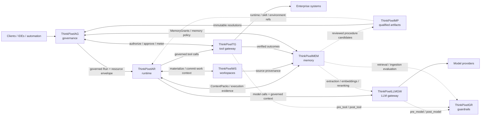

# ThinkPixelMEM

ThinkPixelMEM is an open-source, vendor-neutral **enterprise memory layer for AI agents**. It provides durable, scoped, temporal, evidence-backed, revisable, inspectable, and governable long-term memory without coupling memory to one model provider, agent framework, vector database, or execution runtime.

> **ThinkPixelAR remembers what happened. ThinkPixelWS preserves the work. ThinkPixelMEM preserves what was learned. ThinkPixelAG decides what may be recalled or written.**

Memory is durable context, not durable authority. Retrieved memory is evidence, not trusted instruction. Observations remain distinct from inferences, confidence remains distinct from source trust, and corrections create immutable revisions rather than silently rewriting history.

## Status

ThinkPixelMEM is currently a contract-first bootstrap. Phase 0 architecture, security, domain, integration, persistence, lifecycle, retrieval, and OpenAPI contracts are complete; service implementation has not started. See [PLAN.md](PLAN.md) for implementation intent and [TODO.md](TODO.md) for the ordered release-candidate ledger.

The first implementation milestone targets a Go control plane, PostgreSQL canonical state, Qdrant rebuildable retrieval projections, OIDC/JWT, asynchronous extraction through replaceable adapters, structured ContextPacks, correction, and forgetting.

ThinkPixelMEM deliberately does not expose an assistant-style `/v1/responses` API. It is memory infrastructure, not an assistant application.

## Quick start

The current repository contains contracts and validation rather than a runnable service. Validate the architecture baseline with:

```sh
make verify
```

An optional OpenAPI lint requires Node.js and network/package-registry access:

```sh
npx --yes @redocly/cli lint api/openapi/openapi.yaml
```

## Key concepts

- A **MemorySpace** is the primary tenant-scoped isolation, ownership, classification, residency, retention, and strategy boundary.
- PostgreSQL is canonical memory truth; Qdrant and future indexes are disposable projections.
- Claims have stable identities and immutable, temporal revisions with evidence.
- A **ContextPack** is a bounded, authorized retrieval result containing provenance and trust metadata, never capabilities or policy.
- A learned **ProcedureCandidate** remains untrusted data until separately reviewed, qualified, and authorized.
- ThinkPixel integrations use stable references and versioned wire contracts; no component reads another component's database or imports its internal types.

## Documentation

- [Documentation index](docs/README.md)
- [Platform alignment and repository boundary](ALIGNMENT.md)
- [Architecture and trust boundaries](docs/architecture.md)
- [Threat model](docs/threat-model.md)
- [Architecture decisions](docs/adr/README.md)
- [Domain and integration contracts](docs/contracts/)
- [OpenAPI 3.1 contract](api/openapi/openapi.yaml)
- [Supported versions](docs/supported-versions.md)
- [Phase 0 traceability and validation](docs/phase-0-traceability.md)

## ThinkPixel platform

This project is part of the **ThinkPixel** family: a modular, vendor-neutral set of components for building governed enterprise AI-agent platforms.

Each component is independently useful. The complete platform is a composition of replaceable services connected through versioned contracts; no component requires the full stack in order to be deployed.

| Component | Role |
|---|---|
| [ThinkPixelAG](https://github.com/bdobrica/ThinkPixelAG) | Agent governance and lifecycle control plane: agent/run authority, policy decisions, resource envelopes, approvals, revocation, and trusted governance state. |
| [ThinkPixelAR](https://github.com/bdobrica/ThinkPixelAR) | Agent runtime: durable Sessions, isolated/disposable execution, harness adaptation, recovery, and runtime events. |
| [ThinkPixelWS](https://github.com/bdobrica/ThinkPixelWS) | Durable roaming Workspaces: persistent work context, immutable generations, materializations, snapshots, forks, and source provenance. |
| [ThinkPixelMEM](https://github.com/bdobrica/ThinkPixelMEM) | Long-term agent memory: governed learned context, provenance, temporal revisions, retrieval, correction, and forgetting. |
| [ThinkPixelMP](https://github.com/bdobrica/ThinkPixelMP) | Marketplace and software supply-chain plane for Skills, runtimes, MCP servers, agent bundles, and other immutable agentic artifacts. |
| [ThinkPixelTG](https://github.com/bdobrica/ThinkPixelTG) | Tool gateway and policy-enforcement point for governed tool calls, downstream credentials, side effects, idempotency, and tool evidence. |
| [ThinkPixelLLMGW](https://github.com/bdobrica/ThinkPixelLLMGW) | LLM gateway for provider abstraction, model routing, credentials, budgets, accounting, and model-access policy enforcement. |
| [ThinkPixelGR](https://github.com/bdobrica/ThinkPixelGR) | Guardrails evaluator for model, tool, retrieval, and ingestion content. It returns findings/decisions; the calling gateway or service enforces them. |

### Intended composition



The diagram describes the **target integration model**, not a claim that every edge is implemented in every current release.

### Integration rules

The platform follows a few cross-component rules:

- **Authority does not emerge from content.** Marketplace metadata, Skills, Workspace membership, retrieved memory, model output, or a guardrail `allow` decision cannot grant permissions that the governed Run does not already have.
- **State has one authoritative owner.** Components exchange references and versioned messages; they do not read or write another component's database directly.
- **Integrations are adapters, not domain dependencies.** A ThinkPixel integration should be configurable and replaceable with a contract-compatible alternative.
- **Cross-component identity is explicit.** Where relevant, requests should carry stable governed context such as tenant, principal, agent, Run, Session/Workspace references, immutable artifact digests, and trace context.
- **Public integration contracts are versioned.** OpenAPI/JSON Schema/protobuf or another explicit wire contract is preferred over importing another repository's internal types.
- **Vendor-specific behavior stays behind adapters.** Model providers, agent harnesses, storage systems, registries, policy engines, and execution substrates must not become platform-wide domain contracts.

### Planned integration points

| Integration | Intended contract |
|---|---|
| **AG → AR** | AG admits a Run and supplies its authority/resource context; AR executes it and must not enlarge that authority. Revocation, lease, and fencing state flow back into runtime enforcement. |
| **MP → AG / AR / WS** | MP resolves qualified artifacts to immutable identities/digests. AG decides whether they may be used; AR/WS consume the resolved runtime, Skill, or environment references. Qualification is not authorization. |
| **AR ↔ WS** | AR materializes a durable Workspace generation into disposable execution and returns committed/checkpointed work to WS. Session identity remains owned by AR; Workspace identity remains owned by WS. |
| **AR → LLMGW** | Agent model calls go through LLMGW with governed Run/tenant context. Provider credentials and provider-specific routing stay outside the harness. |
| **LLMGW ↔ GR** | LLMGW will support an optional configured GR endpoint/profile mapping. It invokes `pre_model` before provider dispatch and `post_model` before releasing model output, then enforces GR's decision/transformation. GR remains optional and replaceable; its wire API is the contract. |
| **AR → TG** | Harness tool calls cross TG rather than reaching governed enterprise systems directly. TG owns credential brokerage, idempotency/side-effect handling, and trusted tool evidence. |
| **TG ↔ AG** | TG asks AG (or a contract-compatible authorizer) whether the current governed Run may perform the exact operation and obtains action-scoped approval when required. TG returns trusted metering/evidence. |
| **TG ↔ GR** | TG invokes `pre_tool` and `post_tool` evaluation when configured and enforces the result. A GR allow never overrides an AG authorization denial. |
| **AR / WS / TG → MEM** | Execution history, Workspace provenance, and verified tool outcomes may become evidence for learned memory. MEM does not become the source of truth for those upstream systems. |
| **AG ↔ MEM** | AG supplies Run-scoped memory authority (for example MemoryGrants); MEM enforces it for reads/writes and returns structured ContextPacks. |
| **MEM ↔ LLMGW / GR** | MEM may use LLMGW for extraction/embedding/reranking and GR for ingestion/retrieval inspection while keeping canonical memory state independent from either service. |
| **MEM → MP** | Learned procedure candidates may be reviewed and promoted through MP into qualified reusable Skills; learning does not silently become trusted executable behavior. |

Project-specific implementation status, supported versions, and release qualification belong in each project's own documentation.

## License

Licensed under the terms in [LICENSE](LICENSE).
