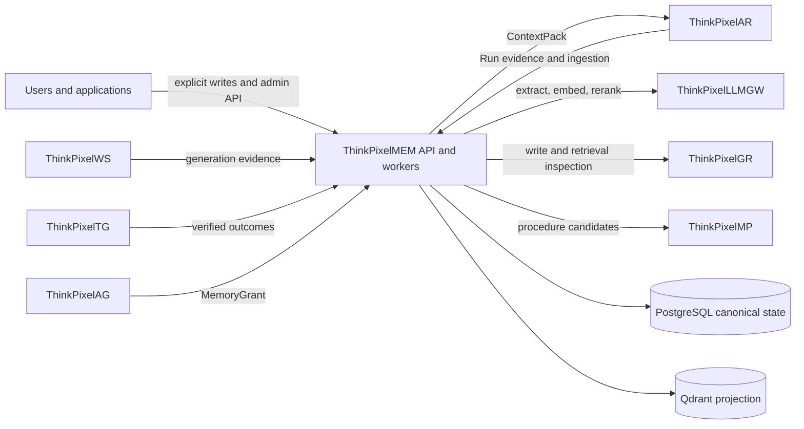
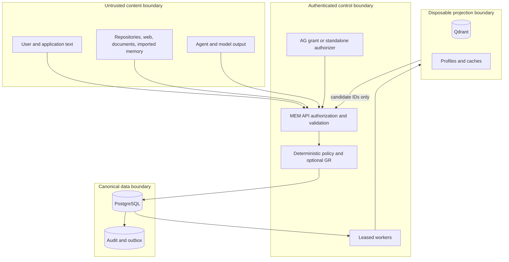

# Architecture and trust boundaries

## System context

## Trust boundaries

Authoritative identity, scope, classification, residency, trust, and evidence metadata cross into MEM only through authenticated adapters. Content remains untrusted at every boundary. Projection filtering is defense in depth; the API reauthorizes and rereads canonical state before disclosure.

