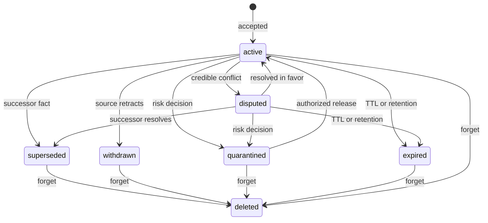

# Retention, correction, dispute, and forget contract

## Status transitions

Transitions append an immutable revision or lifecycle event with actor, reason, policy version, time, and evidence. Deleted is terminal. Corrections require expected active revision and append a new revision. Dispute preserves each competing assertion and exposes a warning. Supersession links predecessor/successor and adjusts valid time without rewriting history.

## Retention and TTL

Effective retention is the most restrictive compatible rule across organization, classification, MemorySpace, subject, and memory type, unless a legal hold requires retention. TTL is computed from server time using the pinned policy version. Policy changes schedule reevaluation; they do not silently backdate deletion. Expiry prevents normal retrieval and emits a lifecycle/outbox event.

## Forget targets

Forget supports memory ID, subject/entity, MemorySpace, evidence source, and user/data-subject. Requests are idempotent and record selector, authority, reason, legal basis/purpose where applicable, and a stable operation ID.

The workflow marks matching canonical records unavailable in one transaction, records deletion work/outbox messages, then removes or rebuilds vectors, sparse/graph projections, profiles, summaries, and caches. Reads exclude records from the moment canonical deletion begins. Repair and rebuild read only eligible canonical state.

## Legal hold and audit

A policy port returns `allow`, `deny`, or `require-review` per record. A hold denial produces RFC 7807 status `409` without partial deletion unless the request explicitly supports reported partial results. Privacy policy may require physical or cryptographic erasure of revision/evidence content. Compliance policy may retain only a non-sensitive marker containing operation ID, tenant, timestamps, category counts, policy decision, and integrity proof—never deleted content or recoverable identifiers when prohibited.

## Guarantees

- Repeating a completed forget is successful and changes nothing.
- A crash resumes from durable work state.
- Projection cleanup is observable and retryable.
- A completed forget means no serving projection can return the memory.
- Index recreation cannot resurrect deleted/expired-ineligible records.

